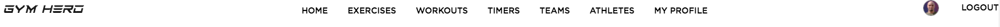

### GYM HERO - Lightweight Athlete/Performance Artist Management System
###### by: Etienne Deneault

[VISIT GYM HERO](https://sb-gym-hero.herokuapp.com/)

Preloaded Profile for Testing:

Username | Password
------------ | -------------
coach_E | coach_E

<small>DATABASE RESETS EVERY 24 HRS - Make any changes you like!</small>

### Project Description

Designed as Capstone project for the SpringBoard Software Engineering Bootcamp, GYM HERO is a lightweight *Athlete Management Web Application*.  There are many athlete management systems available in the market but most have a difficult barrier of access for coaches and smaller athletic organizations.  These "barriers" are due to the following: cost of access, complexity of implementation, complex tooling that generates a significant amount of work for the user/administrator.  

 Many of the athlete mamagement systems do not offer easy access to features that coaches use on a daily basis.  The result of this challenge is that coaches are less likely to use the functionality available.  In "real-world" time, it can be difficult to integrate the management tools into regular training workflows.

### Assign Workout Example View

https://user-images.githubusercontent.com/69206621/117402886-15eefa80-aebc-11eb-8539-08b46a043e78.mp4


### Exercise Timer Example View

https://user-images.githubusercontent.com/69206621/117456143-bf55e080-aefc-11eb-91c1-daf03a7c3b99.mp4

### Workout Builder Example View

https://user-images.githubusercontent.com/69206621/117459624-73a53600-af00-11eb-992f-ceeabe25403f.mp4

## Prerequisites

**Python Environment:**
* *requirements.txt* lists all python requirements

**Technologies:**

HTML | CSS | JAVASCRIPT | PYTHON | FLASK | POSTGRESQL

 * *bcrypt* for authentification and authorization
 * *WTForms* for forms and validation
 * *jinja2* for html templates
 * *sqlalchemy* for database ORM

### Installing

For macOS in BASH terminal:

* clone and re-create environment

<pre class="literal-block" style="background-color: black; color: white;">
$ <span class="cmd">git clone https://github.com/edeneault/SpringBoard-Capstone-1.git</span>
$ <span class="cmd">cd "your project folder"</span>
$ <span class="cmd">python3 -m venv venv</span>
</pre>
<div class="docutils container">

* install requirements 

<pre class="literal-block" style="background-color: black; color: white;">
$ <span class="cmd">source venv/bin/activate</span>
(venv) $ <span class="cmd">pip3 install -r requirements.txt</span>
<span class="gray">... pip output here ...</span>
</pre>

* start flask local server

<pre class="literal-block" style="background-color: black; color: white;">
(venv) $ <span class="cmd">flask run</span>
</pre>

### Contents and Details

###### Folders and Files

```
SB-Capstone-1/

┣ Postgress-gymhero-db/

┣ documentation/

┣ routes/

┣ static/

┣ templates/

┣ testing/

┣ .gitignore

┣ Procfile

┣ README.md

┣ app.py

┣ forms.py

┣ models.py

┣ runtime.txt

┗ utils.py

```


###### Application Main Function

* Provide coaches and performance enhancement specialist with a lightweight system to manage their teams/athletes/performance artists.

###### Application Secondary Function
* Provide coaches and athletes quick access to the most useful tools for Day to Day use. Workouts and Timers.


###### Target Users

* The target user fir the application are Coaches working with smaller team organizations or a coach with a "single" or "few" athletes in individual sports

###### Application Features

*No Auth Access*
* Quick Access - *workout selector* 
* Quick Access - *workout timer example configurations*
    * Timers built with dynamic javasript - Presets: HiitTimer, RoundTimer, CircuitTimer**

*With Auth Access*

* Team/Athlete Managment (CRUD Teams, Athletes, Exercises, Workouts)
* Assign to Athlete Workouts

###### API

* API to be used for exercise data and exercise images: <a style="color: CadetBlue" href="https://wger.de/en/software/api">WEGR</a>
    * >Public Endpoints used: 
      exercisecategory, muscle, exerciseimage, exerciseinfo, equipment

<br>

###### DATABASE SCHEMA REPRESENTATION 


* additional tables will be needed for medical_status, timers and training_plans.


#### Author

* **Etienne Deneault** - *Initial work* - [edeneault](https://github.com/edeneault)

##### License

This project is licensed under the MIT License - see the [LICENSE.md](LICENSE.md) file for details

##### Future Development

* TODO: Team/Athlete Management Dashboard - Team Data view and basic analysis (RPE, workload over time)
* TODO: Add CRUD CATEGORY, EQUIPMENT, MUSCLE routes
* TODO: Add SEARCH BY category || equipment || muscles
* TODO: Add NAVOGATE BACK TO WORKOUT OPTION after editing EXERCISE
* TODO: ADD cloudinary storage and cdn image delivery | user image upload functionality

<p style="color: red;">IMPORTANT: Application allows for uploading of images from users.  Image Rights may or may not be copyrighted.  All images used as base images, are Crative Commons License </p>
<p style="color: red;">INFO:  Documentation and Testing in Progress</p>
<p style="color: dark-gray;">Kindly start an issue to help me dedug the application and implement new features.</p>
